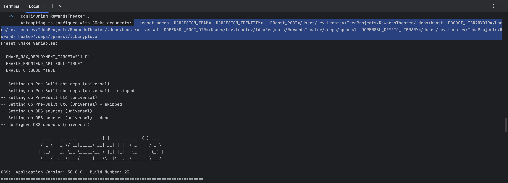
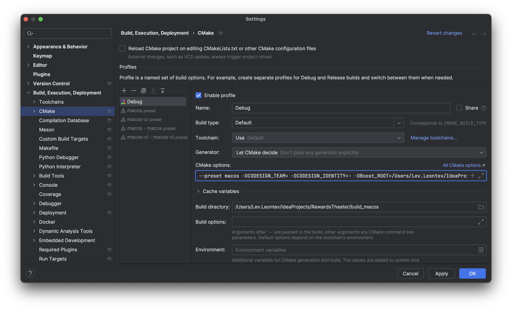

# Building RewardsTheater

## Building locally on Windows
1. Install a new version of [PowerShell](https://learn.microsoft.com/en-us/powershell/scripting/install/installing-powershell-on-windows?view=powershell-7.3)
2. Install [Visual Studio 2022 (or later)](https://visualstudio.microsoft.com/vs/) and install the bundled C++ compiler.
3. Install [Chocolatey](https://chocolatey.org/).
4. Instal OpenSSL via chocolatey: `choco install openssl`.
5. Install [7zip](https://www.7-zip.org/) and add `C:\Program Files\7-Zip` to [PATH](https://www.wikihow.com/Change-the-PATH-Environment-Variable-on-Windows).
6. Restart the PowerShell terminal so that `OpenSSL` and `7z` commands are visible.
7. Clone this repository via Git.
8. Run `.github/scripts/Build-Windows.ps1` inside PowerShell.

## Setting up development environment on Windows
These steps are a continuation of the previous section on building.

1. Install [pre-commit](https://pre-commit.com/) and run `pre-commit install` in the root of the repository in order to format code automatically before a commit. (This uses [.pre-commit-config.yaml](.pre-commit-config.yaml) and [.clang-format](.clang-format)).
2. - Clone [OBS Studio](https://github.com/obsproject/obs-studio) **recursively**:
     ```
     git clone https://github.com/obsproject/obs-studio --recursive
     ```
   - Check out a tag you want to compile (e.g. `git reset --hard 30.0.0`).
   - Execute the following command to generate a Visual Studio solution:
     ```
     cmake --preset windows-x64
     ```

   - Open the `obs-studio/build_x64` folder in Visual Studio and build the solution as `Debug`.
3. Open the `RewardsTheater/build_x64` directory. Open `CMakeCache.txt` and add the following line:
   ```
   OBS_BUILD_DIR:FILEPATH=../../obs-studio/build_x64/rundir/Debug
   ```
   This is needed for CMake to copy the plugin into the OBS installation.

4. Then build RewardsTheater again via `.github/scripts/Build-Windows.ps1`.
5. Open the project in Visual Studio. Right-click the `ALL_BUILD` project. Select "Debug" in the "Configuration:" dropdown. Open the "Debugging" pane on the left. Set the "Command:" to the OBS binary at `your_user_dir\source\repos\obs-studio\build64\rundir\Debug\bin\64bit\obs64.exe`, and the working directory to `your_user_dir\source\repos\obs-studio\build64\rundir\Debug\bin\64bit`.
6. Now when you hit "Run" inside Visual Studio, the plugin is copied automatically to the rundir and then Visual Studio launches OBS for debugging.

## Building locally on Linux
1. Install GCC 12 (or later) via `sudo apt install gcc-12 g++-12` (use your favorite package manager).
2. Clone the repository.
3. Run
   ```bash
   export CC=gcc-12
   export CXX=g++-12
   sudo ./.github/scripts/build-linux
   ```

## Building locally on macOS
1. Install a recent version of Xcode.
2. Clone the repository.
3. Run `.github/scripts/build-macos`

## Setting up development environment on Unix (Linux/macOS)
1. Execute the corresponding build script again (either `./.github/scripts/build-linux` or `./.github/scripts/build-macos`).
2. Find the CMake arguments by searching for "Attempting to configure with CMake arguments" in the build script output:
   
3. Copy those arguments into your IDE of choice. Here is where to paste the CMake options in CLion, for example:
   
4. There's probably a way to debug the plugin properly, but for now you can just build the plugin via the build script
   and install manually when you want to test your changes.

## GitHub Actions & CI

Default GitHub Actions workflows are available for the following repository actions:

* `push`: Run for commits or tags pushed to `master` or `main` branches.
* `pr-pull`: Run when a Pull Request has been pushed or synchronized.
* `dispatch`: Run when triggered by the workflow dispatch in GitHub's user interface.
* `build-project`: Builds the actual project and is triggered by other workflows.
* `check-format`: Checks CMake and plugin source code formatting and is triggered by other workflows.

The workflows make use of GitHub repository actions (contained in `.github/actions`) and build scripts (contained in `.github/scripts`) which are not needed for local development, but might need to be adjusted if additional/different steps are required to build the plugin.

### Retrieving build artifacts

Successful builds on GitHub Actions will produce build artifacts that can be downloaded for testing. These artifacts are commonly simple archives and will not contain package installers or installation programs.

### Building a Release

To create a release, an appropriately named tag needs to be pushed to the `main`/`master` branch using semantic versioning (e.g., `12.3.4`, `23.4.5-beta2`). A draft release will be created on the associated repository with generated installer packages or installation programs attached as release artifacts.
