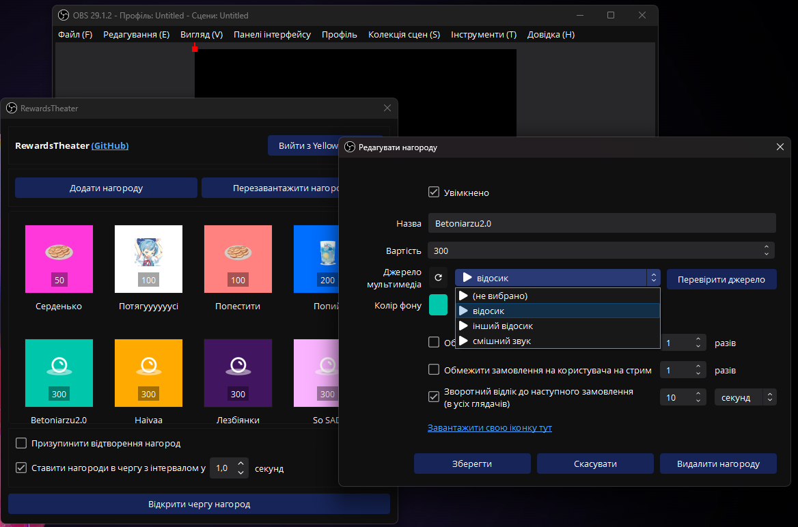
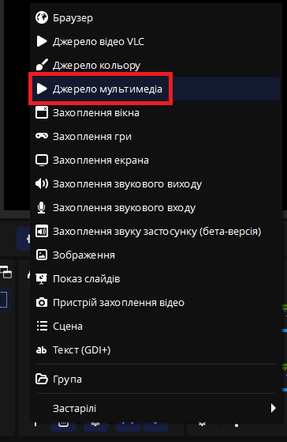
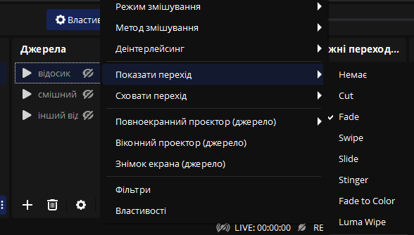
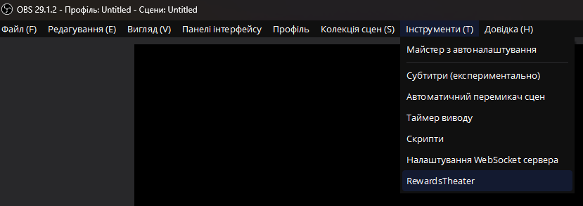
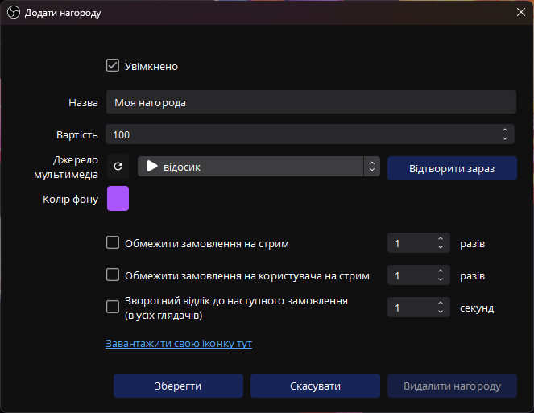
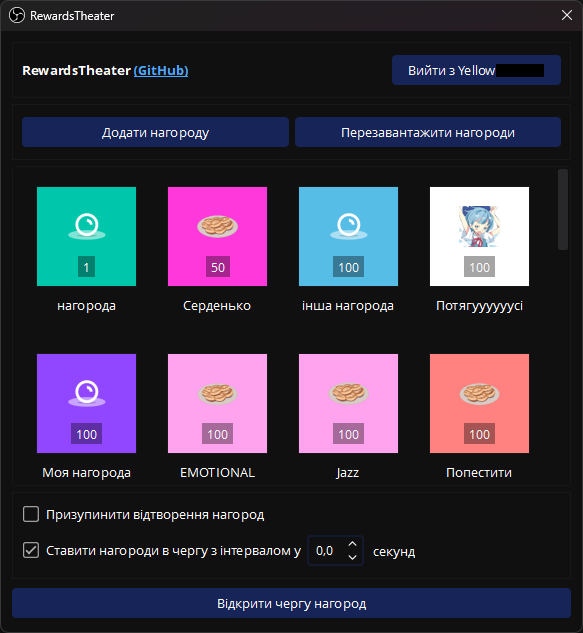
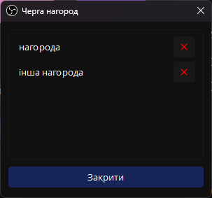

# RewardsTheater

Плагін до [OBS](https://obsproject.com/), який дозволяє твоїм глядачам замовляти відео та звуки на стримі за бали каналу.

[Подивись це відео](https://youtu.be/-0evZCAlXVU) (якщо знаєш англійську) про те, як усе налаштувати. 
Або можна прочитати повні інструкції нижче.

[Read in English here](README.md)

## Чим він кращий ніж [TR!GGER FYRE](https://overlays.thefyrewire.com/widgets/triggerfyre/)?

- Вільне та відкрите програмне забезпечення.
- Можна використовувати локально збережені відео. Не треба нічого завантажувати на сервер.
- Є гарний інтерфейс для редагування нагород прямо всередині OBS!
- Використовує вбудовані джерела відео OBS замість джерела «Браузер». Це означає більший FPS та значно кращу якість.
- Може відтворювати декілька відео, якщо ти хочеш (просто додай декілька відео в Джерело відео VLC).
- Замовлення нагород можна поставити в чергу, щоб вони не грали одночасно.



## Вимоги
- Ти Twitch Affiliate або Partner, і в тебе ввімкнені бали каналу.
- OBS 30.0.0 або новішої версії.

## Налаштування
### Установлення на Windows
1. Установи останню версію Visual C++ Redistributable [звідси](https://aka.ms/vs/17/release/vc_redist.x64.exe).
2. Завантаж та запусти exe інсталятор за [цим посиланням](https://github.com/gottagofaster236/RewardsTheater/releases/latest).
3. Замість інсталятора, можна завантажити zip файл та розпакувати його в папку, куди встановлено OBS (зазвичай `C:\Program Files\obs-studio`).

### Установлення на macOS
1. Завантаж файл `macos-universal.pkg` [звідси](https://github.com/gottagofaster236/RewardsTheater/releases/latest).
2. **Інсталятор не має електроного підпису, бо підпис від Apple коштує $100 на рік.**
   Спершу клікні двічі на завантажений інсталятор, але не вилучай його з комп'ютера, як пропонує macOS. Далі дозволь виконання інсталятору згідно з інструкціями на [сайті Apple](https://support.apple.com/uk-ua/guide/mac-help/mh40616/mac).
3. Клікай «Далі» в інсталяторі поки плагін не буде встановлено.

### Установлення на Linux
<details>

+ #### **Debian/Ubuntu**
  Для Ubuntu та інших дистрибутивів, заснованих на Debian, можна завантажити deb файл за [цим посиланням](https://github.com/gottagofaster236/RewardsTheater/releases/latest). Потім установи його наступним чином:
  ```
  sudo dpkg -i /path/to/deb/file
  ```

+ #### **Flathub**
  Можна встановити RewardsTheater через Flathub таким чином:
  ```
  flatpak install flathub com.obsproject.Studio.Plugin.RewardsTheater
  ```

+ #### **Arch Linux**
  ```
  sudo pacman -S --needed base-devel
  git clone https://github.com/gottagofaster236/RewardsTheater
  cd RewardsTheater
  makepkg -si
  ```
</details>

### Додавання джерела
1. RewardsTheater підтримує відео і звуки. Інструкції для цього аналогічні.
2. Додай джерело OBS для кожного відео, яке те хочеш додати як нагороду за бали каналу. Підтримуються «Джерело мультимедіа» або «Джерело відео VLC»:
   
   
3. Вибери файл із відео зі свого комп'ютера. Якщо ти хочеш, щоб відео з'являлося та зникало плавно, вибери переходи (показати/сховати) для джерела:
   
   
4. Розташуй джерело на сцені так, як тобі хочеться.
5. Якщо ти хочеш чути відео, коли чат його замовляє, то знайди джерело в «Мікшер аудіо», натисни на нього правою кнопкою миші, вибери «Розширені властивості аудіо» і вибери «Прослуховування та вивід» у стовбці «Прослуховування звуку».

### Додавання джерела з випадковим відео
Ти можеш використовувати VLC Video Source з декількома відео в плейлисті. Тоді RewardsTheater щоразу відтворюватиме випадкове відео з цього плейлисту.

### Створення нагороди

1. Натисни Інструменти → RewardsTheater.
   
   
2. Спочатку треба ввійти у Twitch, натиснувши на «Увійти».
3. Потім треба натиснути на «Додати нагороду». Не забудь додати джерело, яке було створено раніше, як джерело мультимедіа для нагороди. **Натисни на «Перевірити джерело», щоб перевірити, чи працюватиме джерело.** Через обмеження API Twitch, завантажити свою іконку можна тільки в браузері.
   
   

7. Згодом можна ще раз відредагувати нагороду, натиснувши на неї в меню Інструменти → RewardsTheater.

   

8. Якщо нагород багато, можна помістити джерела мультимедіа на окрему сцену, і додати цю сцену на інші сцени.

### Відстеження нагород
1. Під час стриму можна стежити за чергою нагород у разі, якщо одночасно є багато замовлень. Можна також скасувати замовлення, натиснувши на хрестик — тоді бали каналу буде повернуто відповідному глядачу.

   

2. Можна натиснути на «Призупинити відтворення нагород» на екрані з налаштуваннями, якщо ти не хочеш, щоб відео відтворювалися певний час. У цей час глядачам також будуть повертатися їхні бали.

## Підтримати розробника
Якщо не складно, постав зірку на GitHub репозиторій 🙂

## Building
PRs are welcome! If you want to build RewardsTheater yourself, please refer to [BUILDING.md](BUILDING.md)

## License and credits
- RewardsTheater is licensed under GNU General Public License v3.0. 
- RewardsTheater is a plugin to [OBS Studio](https://github.com/obsproject/obs-studio), which is licensed under GNU General Public License v2.0 or later.
- RewardsTheater uses [Boost.Asio](https://www.boost.org/doc/libs/1_83_0/doc/html/boost_asio.html), [Boost.URL](https://www.boost.org/doc/libs/1_83_0/libs/url/doc/html/index.html), [Boost.Beast](https://www.boost.org/doc/libs/1_83_0/libs/beast/doc/html/index.html), [Boost.JSON](https://www.boost.org/doc/libs/1_83_0/libs/json/doc/html/index.html), which are licensed under the Boost Software License, Version 1.0.
- RewardsTheater uses [Qt Core](https://doc.qt.io/qt-6/qtcore-index.html), [Qt Widgets](https://doc.qt.io/qt-6/qtwidgets-index.html) and [Qt GUI](https://doc.qt.io/qt-6/qtgui-index.html) modules, which are available under GNU General Public License v2.0 or later.
- RewardsTheater uses [OpenSSL](https://openssl.org/), which is licensed under Apache-2.0 License.
- RewardTheater uses Google's [material-design-icons](https://github.com/google/material-design-icons/tree/master), which are licensed under Apache-2.0 license.
- Arch Linux PLGBUILD file contributed by @deadYokai
