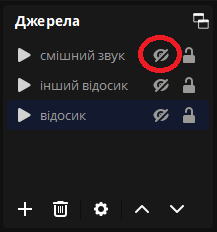

# RewardsTheater

Плагін до [OBS](https://obsproject.com/), який дозволяє твоїм глядачам замовляти відео та звуки на стримі за бали каналу.

[Read in English here](README.md)

## Чим він кращий ніж [TR!GGER FYRE](https://overlays.thefyrewire.com/widgets/triggerfyre/)?

- Вільне та відкрите програмне забезпечення.
- Можна використовувати локально збережені відео. Не треба нічого завантажувати на сервер.
- Є гарний інтерфейс для редагування нагород прямо всередині OBS!
- Використовує вбудовані джерела відео OBS замість джерела «Браузер». Це означає більший FPS та значно кращу якість.
- Ти можеш зручно розташувати відео в самому OBS.
- Замовлення нагород можна поставити в чергу, щоб вони не грали одночасно.

## Вимоги
- Ти Twitch Affiliate або Partner, і в тебе ввімкнені бали каналу.
- OBS 29.1.2 або новішої версії.
- Операційна система Windows або Linux.

## Установлення
1. Завантаж та запусти інсталятор для своєї операційної системи [за цим посиланням](https://github.com/gottagofaster236/RewardsTheater/releases/latest).
2. Додай джерело OBS для кожного відео, яке те хочеш додати як нагороду за бали каналу. Підтримуються «Джерело мультимедіа» або «Джерело відео VLC». Вибери файл із відео зі свого комп'ютера.
   
   
   
   Розташуй джерело на сцені так, як тобі хочеться. Після цього приховай джерело, щоб воно не відтворювалося щоразу, коли ти запускаєш OBS.
   
   
3. Потім натисни Інструменти → RewardsTheater.
   
   
4. Спочатку треба ввійти у Twitch, натиснувши на «Увійти».
5. Потім треба натиснути на «Додати нагороду». Не забудь додати джерело, яке було створено раніше, як джерело мультимедіа для нагороди. **Натисни на «Перевірити джерело», щоб перевірити, чи працюватиме джерело.** Через обмеження API Twitch, завантажити свою іконку можна тільки в браузері.
   
   

6. Згодом можна ще раз відредагувати нагороду, натиснувши на неї в меню Інструменти → RewardsTheater.

   
   
7. Під час стриму можна стежити за чергою нагород у разі, якщо одночасно є багато замовлень. Можна також скасувати замовлення, натиснувши на хрестик — тоді бали каналу буде повернуто відповідному глядачу.

   

8. Можна натиснути на «Призупинити відтворення нагород» на екрані з налаштуваннями, якщо ти не хочеш, щоб відео відтворювалися певний час. У цей час глядачам також будуть повертатися їхні бали.

## Підтримати розробника
Якщо не складно, постав зірку на GitHub репозиторій 🙂

## Building
PRs are welcome! If you want to build RewardsTheater yourself, please refer to [BUILDING.md](BUILDING.md)

## License and credits
- RewardsTheater is licensed under GNU General Public License v2.0 or later. 
- RewardsTheater is a plugin to [OBS Studio](https://github.com/obsproject/obs-studio), which is licensed under GNU General Public License v2.0 or later.
- RewardsTheater uses [Boost.Asio](https://www.boost.org/doc/libs/1_83_0/doc/html/boost_asio.html), [Boost.URL](https://www.boost.org/doc/libs/1_83_0/libs/url/doc/html/index.html), [Boost.Beast](https://www.boost.org/doc/libs/1_83_0/libs/beast/doc/html/index.html), [Boost.JSON](https://www.boost.org/doc/libs/1_83_0/libs/json/doc/html/index.html), which are licensed under the Boost Software License, Version 1.0.
- RewardsTheater uses [Qt Core](https://doc.qt.io/qt-6/qtcore-index.html), [Qt Widgets](https://doc.qt.io/qt-6/qtwidgets-index.html) and [Qt GUI](https://doc.qt.io/qt-6/qtgui-index.html) modules, which are available under GNU General Public License v2.0 or later.
- RewardsTheater uses [OpenSSL](https://openssl.org/), which is licensed under Apache-2.0 License.
- RewardTheater uses Google's [material-design-icons](https://github.com/google/material-design-icons/tree/master), which are licensed under Apache-2.0 license.
